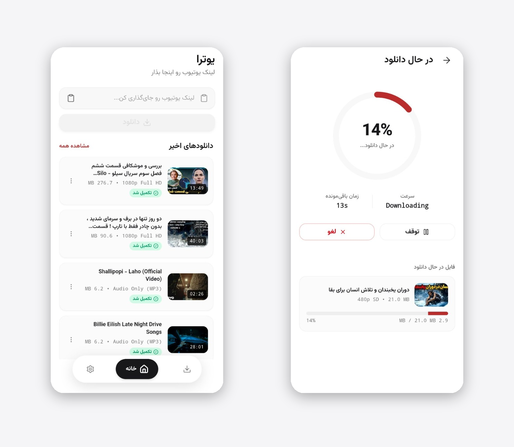

<div align="center">
  

# 🚀 Yootra (یوترا)

**The fastest and easiest way to download YouTube videos and audio on your mobile device.**

[](#https://github.com/yootra/yootra-mobile/releases/latest)
[](#https://www.coffeete.ir/sajjadmrx)

<br>
  
</div>

<br>

Yootra is a beautiful, easy-to-use mobile application that allows you to download your favorite YouTube videos and music with just a few taps. It's built for everyone—no technical knowledge required!

## ✨ Key Features

- **Direct Share to Download**: No need to copy and paste! Just tap 'Share' on any YouTube video and select Yootra to start your download instantly.

<div align="center">
  
</div>
- **Multiple Qualities**: Choose to download videos in stunning 1080p Full HD, or lower resolutions to save space.
- **Audio Only**: Convert and download videos directly as MP3 audio files.
- **Smart Download Manager**: Track your download speed, view remaining time, and effortlessly pause/resume your downloads.
- **Sleek & Simple Interface**: Enjoy a premium, ad-free-like experience with a clean Persian UI.
- **Offline Enjoyment**: Watch your favorite content or listen to music anywhere, anytime, without an internet connection.

## 📱 How to Use

1. **Copy Link**: Go to YouTube and copy the link of any video you like.
2. **Paste**: Open Yootra and paste the link into the top search bar.
3. **Select Format**: Choose if you want the Video format or Audio only.
4. **Download**: Tap the download button and wait for the magic to happen!

## ❤️ Support the Project (Donate)

Yootra is provided for free! If you enjoy using the app and want to help keep it alive, please consider making a donation. It helps cover development and maintenance costs.

👉 **[Donate Here](https://www.coffeete.ir/sajjadmrx)**

---

## 💻 For Developers

If you want to contribute or run the project locally on your machine:

```bash
git clone https://github.com/yourusername/yt-downloader-app.git
cd yt-downloader-app
bun install
bun dev
```